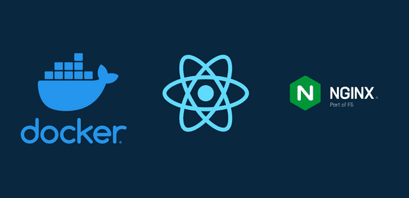
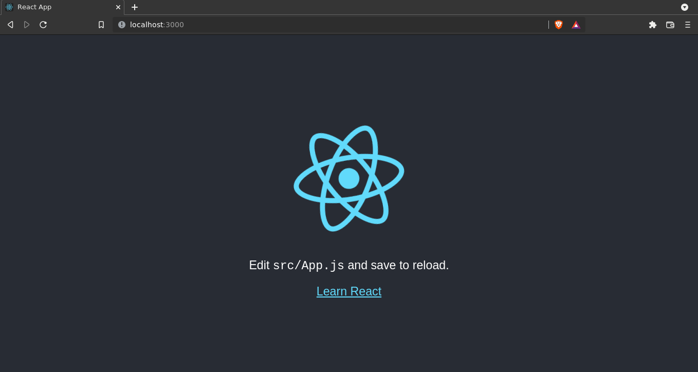
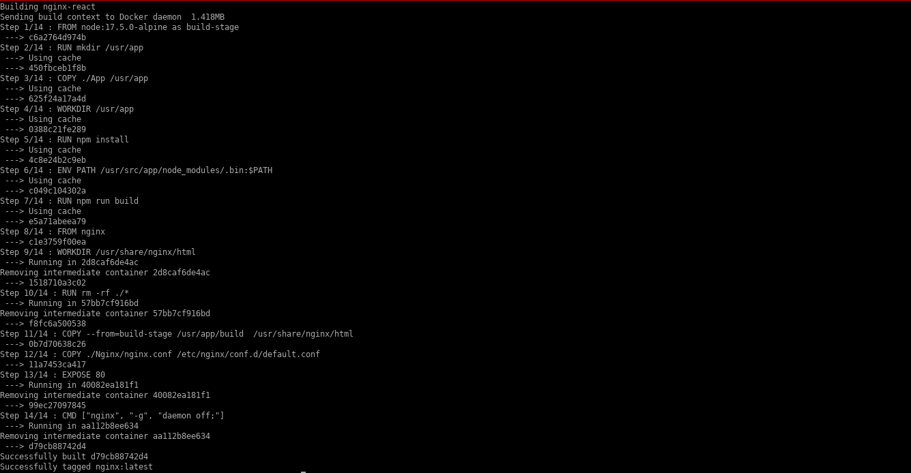
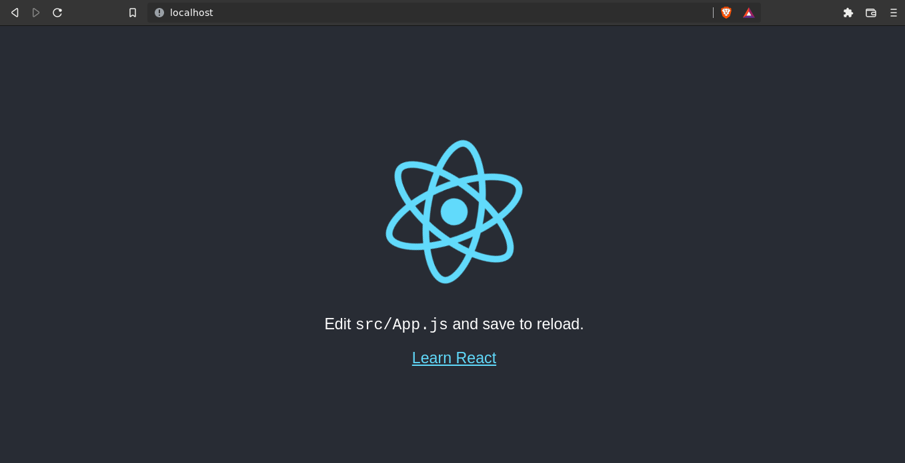

# Desafio Tech


> ​																			  





## Sobre

O projeto para o  **Desafio Tech** consiste em realizar um Deploy de uma aplicação React usando Docker e Nginx.

**Requisitos para desenvolvimento**:

1. Aplicação padrão React disponível em (https://create-react-app.dev/docs/getting-started).

2. Aplicação deverá ser versionada e publicada para apresentação em repositório git.
3. Instruções
   * Aplicação deverá conter um arquivo Dockerfile para realizar a build (construção da aplicação).
   * O arquivo responsável por subir o container deverá ser o Docker-compose contendo as demais informações (Ex. porta, nome, imagem e etc...).
   * O container deverá rodar em uma porta diferente da 3000, pois a aplicação em React já vem pré-configurada para isso, e queremos que explore e entenda as configurações de porta do Docker

## Requisitos de software

   


## Desenvolvimento

> Todo o desenvolvimento do Deploy foi realizado em ambiente Linux.
>
> Distribuição: Debian 11 Bullseye + i3wm


A princípio precisamos construir a aplicação  React usando o Node.js. Para isso, crie e inicie a aplicação usando os seguintes comandos

```sh
npx create-react-app my-app
cd my-app
npm start
```

Se tudo estiver correto, basta acessar o browser na porta 3000. Para parar a aplicação, basta pressionar Ctrl+c.




## Dockerfile

O dockerfile é um arquivo simples de texto puro usado para construir automaticamente uma imagem de acordo com alguns comandos específicos. Dessa forma, podemos especificar quais instruções de linhas de comando serão executadas de acordo com nosso contexto de produção. Para este projeto, foi divido dois estágios de execução de comandos. O primeiro estágio irá lidar com a construção da imagem Node para o projeto React, já o segundo estágio, construirá a imagem Nginx para rodar nossa aplicação.


**Estágio 1 - Construindo uma imagem Node**

Para a construção da imagem Node, foi utilizado a distribuição **Alpine**, visto que, foi criada especificamente pra uma imagem do Docker e, dessa maneira, o consumo do espaço em disco é significativamente menor do que outras imagens. O comando **as** cria um apelido para a imagem, o apelido apenas facilita o seu uso em instruções posteriores.  

```dockerfile
FROM node:17.5.0-alpine as build-stage
```


Criando o diretório de trabalho com o comando **mkdir**( make directory ) para a aplicação React

```dockerfile
RUN mkdir /usr/app
```


Copiando o projeto React que está no diretório **App** para o diretório de trabalho na imagem Node. Note que foi criado um diretório **App** onde se encontra nossa aplicação. Copie e cole todos os arquivos criado na criação do **my-app** anteriormente. Por fim, apenas delete o diretório **node_modules**, pois as depêndencias do projetos serão instalados na construção da imagem.  

```dockerfile
COPY ./App /usr/app
```


Definindo o diretório de trabalho da imagem. Dessa maneira, as instruções de linha de comando posteriores serão executadas neste diretório.

```dockerfile
WORKDIR /usr/app
```


Instalando todas as depêndencias do projeto encontradas em **package.json**

```dockerfile
RUN npm install
```


Adicionando o diretório **.bin** no PATH

```dockerfile
ENV PATH /usr/src/app/node_modules/.bin:$PATH
```


Criando um diretório de compilação do projeto para produção

```dockerfile
RUN npm run build
```


**Estágio 2 - Construindo a imagem Nginx e rodando a aplicação React**

Especificando a imagem a ser utilizada

```dockerfile
FROM nginx
```


Definindo o diretório de trabalho para o servidor Nginx

```dockerfile
WORKDIR /usr/share/nginx/html
```


Removendo todos os arquivos padrões do diretório de trabalho

```dockerfile
RUN rm -rf ./*
```


Copiando a **build**  do projeto React gerada anteriormente e colando no diretório de trabalho do servidor Nginx. Note a utilização do apelido **build** declarado anteriormente com o comando **as**

```dockerfile
COPY --from=build-stage /usr/app/build  /usr/share/nginx/html
```


A fim de utilizar o nginx como um servidor para nosso aplicativo e permitir que o React rode em outra porta ao invés da padrão, criamos o seguinte arquivo de configuração **nginx.conf**, definindo qual porta o servidor ouvirá e qual o caminho raiz para diretório de trabalho o Nginx atuará.

```shell
server {
      listen 80;
      location / {
      root /usr/share/nginx/html;
      index index.html index.htm;
      	try_files $uri $uri/ /index.html =404;
      }
}
```


Copiando o arquivo de configuração para o diretório de configuração padrão do Nginx. Note que o arquivo **nginx.conf** está contido dentro do diretório  **Nginx**

```dockerfile
COPY ./Nginx/nginx.conf /etc/nginx/conf.d/default.conf
```


Expecificando qual porta o servidor estará ouvindo em tempo real de execução. Por padrão, estará rodando o protocolo **TCP**

```
EXPOSE 80
```


Por fim, o comando CMD proverá a execução padrão do **nginx** no contâiner. Desse modo, é passado o parâmetro **-g** para setar a permissão de diretivas e a  diretiva **daemon off** para permitir que o Nginx execute em foreground

```dockerfile
CMD ["nginx", "-g", "daemon off;"]
```


**Arquivo final**

O arquivo final do Dockerfile será algo como

```dockerfile
#Estágio 1 - Construir uma imagem docker do React

FROM node:17.5.0-alpine as build-stage

#Criando o diretório de trabalho
RUN mkdir /usr/app

#Copiando os arquivos para o diretório
COPY ./App /usr/app

#Definindo diretório de trabalho
WORKDIR /usr/app

#Instalando todas dependências
RUN npm install

#Adicionando .bin no PATH
ENV PATH /usr/src/app/node_modules/.bin:$PATH

#Criando uma build de produção otimizada
RUN npm run build

#Estágio 2 - Copiando o React App para o NGINX
FROM nginx

#Definindo diretório de trabalho do NGINX
WORKDIR /usr/share/nginx/html

#Removendo todos arquivos padrões do diretório de trabalho
RUN rm -rf ./*

#Copiando a build gerada para o diretório de trabalho do nginx
COPY --from=build-stage /usr/app/build  /usr/share/nginx/html

#Copiando o arquivo de configuração do servidor para a configuração padrão do nginx
COPY ./Nginx/nginx.conf /etc/nginx/conf.d/default.conf

#Expondo a porta 80/TCP
EXPOSE 80

#Iniciando o nginx em modo foreground
CMD ["nginx", "-g", "daemon off;"]

```


## Docker compose

A fim de orquestrar e descrever melhor a infraestrutura como código e como ela vai se comportar ao ser iniciado, criamos o arquivo de configuração YAML **docker-compose** para definir os serviços a serem executados. Repare nas configurações abaixo que definimos o nome do container, a imagem,  a build que definirá em qual contexto está presente o **Dockerfile**, a porta que será mapeada entre o host e o contâiner e uma configuração para restartar sempre que houver qualquer tipo de falha.

```
version: "3.8"
services:
  nginx-react:
    image: "nginx"
    container_name: nginx-reactapp
    build:
      context: .
      dockerfile: Dockerfile
    ports:
      - "80:80"
    restart: always
```


## Execução

Para construirmos o ambiente de produção criado, rode o seguinte comando

```sh
docker-compose build
```


A saída deverá ser algo parecido com a imagem abaixo. Caso haja alguns WARN gerado pelo npm,  provavelmente poderá ser algo relacionado as novas versões de pacotes. No entanto, o Deploy foi realizado com sucesso




Para rodar o ambiente em background, apenas execute

```
sudo docker-compose up -d
```


Acesse o browser em localhost na porta 80 e pronto, a aplicação React estará rodando no servidor nginx.




Para parar o contâiner, apenas execute

```
docker stop nginx-reactapp
```

## Links
[node]: https://hub.docker.com/_/node	"Official build of Node"
[nginx]: https://hub.docker.com/_/nginx	"Official build of Nginx."
[react]: https://create-react-app.dev/docs/getting-started	"Get Started with React."
[docker]: https://www.docker.com/get-started	"Get Started with Docker."


## Informações

Marlon Brendo Ramos – [github/MarlonBrendonx](https://github.com/MarlonBrendonx)  [Lindkedin](https://www.linkedin.com/in/marlon-brendo-ramos-204763225/) – marlonbrendo2013@gmail.com


